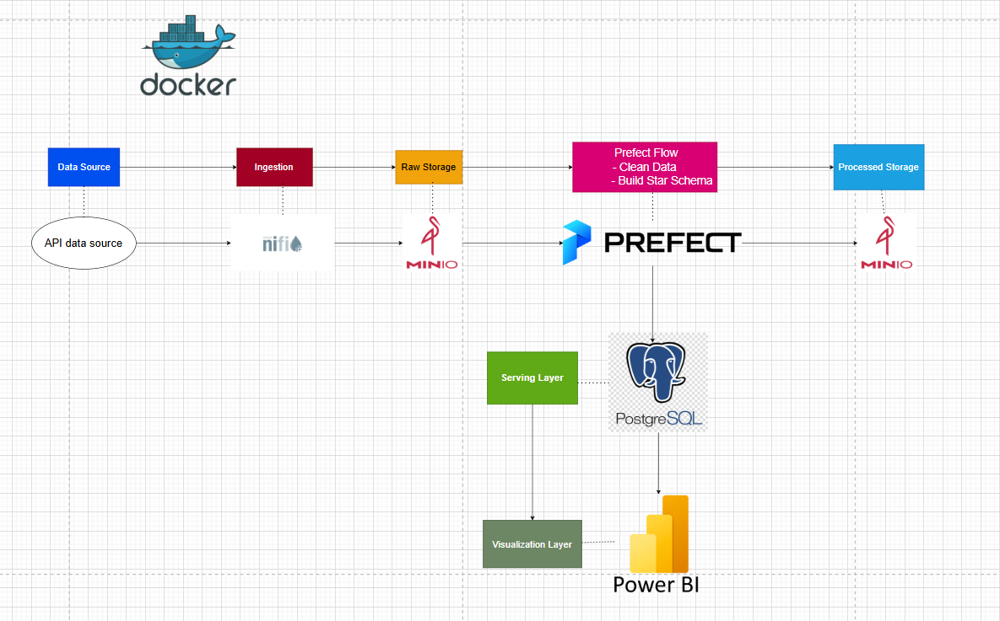

# 📦 Retail Sales Data Engineering Pipeline

---

## 1️⃣ Project Architecture

This project implements an **end-to-end data engineering pipeline** for processing online retail data.  

**Pipeline Overview:**  

- **Data Source:** Kaggle API  
- **Ingestion:** NiFi to bring raw data into storage  
- **Storage:** MinIO for raw and processed data  
- **ETL & Transformation:** Prefect cleans, transforms, and builds a star schema  
- **Data Warehouse:** PostgreSQL with fact & dimension tables + views  
- **Visualization:** Power BI dashboards connected to PostgreSQL views  
- **Containerization:** Docker ensures reproducibility  

**Pipeline Architecture Diagram:**  

> Replace the path below with your image location

---

## 2️⃣ Folder Structure

## 2️⃣ Folder Structure

.
├── docker-compose.yaml # Docker environment configuration
├── Dockerfile # Container setup
├── requirements.txt # Python dependencies
├── data/ # Dataset (CSV for GitHub)
│ └── raw/
│ └── sales.csv
├── flows/ # Prefect flows
│ └── etl_sales_flow.py
├── nifi/ # NiFi flow configurations
│ └── flows/http_to_s3.xml
├── PowerBI/ # Power BI dashboards
│ └── Dashboard.pbix
├── Sql_Scripts/ # SQL scripts for table & view creation
│ └── script1.sql ... script5.sql
├── docs/ # Documentation and diagrams
│ └── pipeline_diagram.png

ruby
Copier le code

> **Note:**  
> - `minio_data/` is ignored in the repository via `.gitignore`.  
> - Only necessary files and GitHub-hosted CSV are included.

---

## 3️⃣ Project Explanation

This project demonstrates a **complete data engineering workflow**:

1. **Data Ingestion:** NiFi pulls the dataset from Kaggle and stores it in raw storage (MinIO).  
2. **ETL & Transformation:** Prefect automates extracting raw data, cleaning it, and building a star schema (`FactSales`, `DimDate`, `DimProduct`, `DimCustomer`).  
3. **Storage:** Processed data is stored in MinIO and loaded into PostgreSQL.  
4. **Views for BI:** PostgreSQL views simplify reporting queries for Power BI.  
5. **Visualization:** Power BI dashboards visualize KPIs such as sales trends, top products, and customer metrics.  
6. **Containerization:** Docker ensures all components can be deployed consistently across environments.
